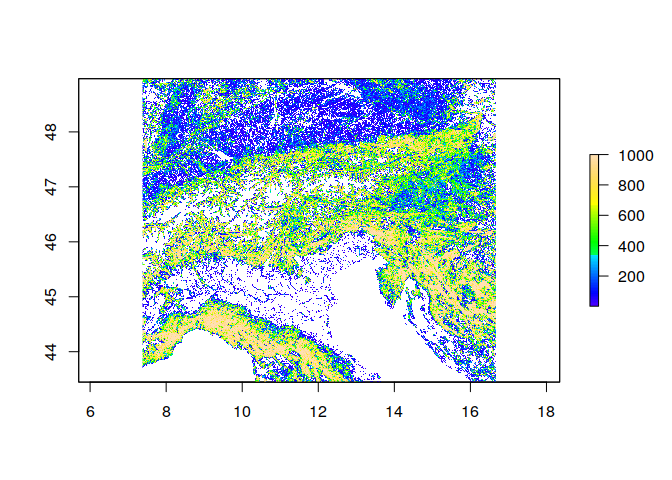
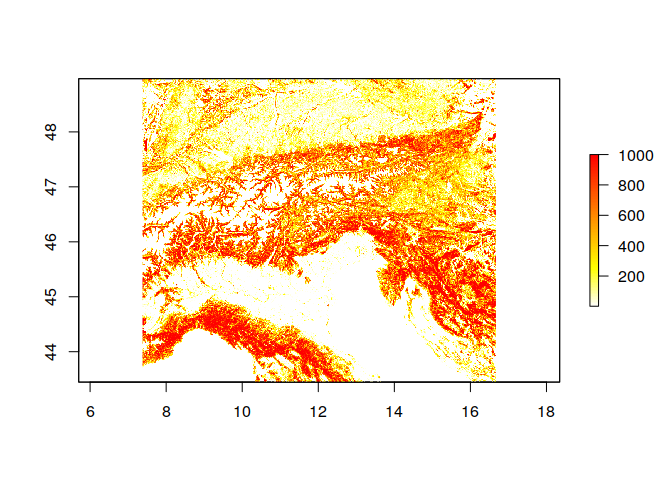
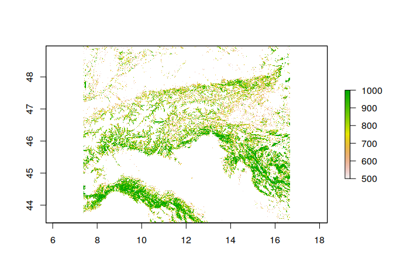
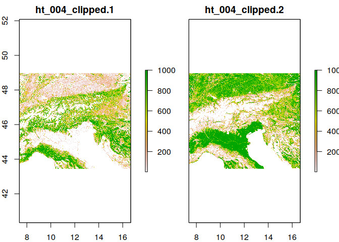

[<i class="fa fa-file-code-o fa-3x" aria-hidden="true"></i> The R Script associated with this page is available here](02_raster.R).  Download this file and open it (or copy-paste into a new script) with RStudio if you want to follow along.  

# Working with raster data

Raster data in R can be loaded in a relatively straight forward way using the **raster** package. There are other ways of loading raster data, including implementations in **sp**, where raster data can be formatted as 'SpatialPixelsDataFrame()'. 

The **raster** package is still the most widely used package though, although it is increasingly being replaced by an approach that is based on a tidy concept (separating raw data from metadata and spatial information). More on this later

First, lets load the raster package and some first prepared data. If the loading below does not work, download the tif <a href="ht_004_clipped.tif"> here</a> or from the repository


```r
library(raster)
```

```
## Loading required package: sp
```

```r
# The data to load is from Jung et al. (2020), https://www.nature.com/articles/s41597-020-00599-8
# I have prepared a subset for the Alpes to load in here. 
# These contain the fraction (multiplied with 1000) of a grid cell containing forest or arti at 1km. 

# We now load the forest layer from this object
ras <- raster('ht_004_clipped.tif',layer = 1)

class(ras)
```

```
## [1] "RasterLayer"
## attr(,"package")
## [1] "raster"
```

```r
# Note that the range of values is loaded by default to the minimum and maximum possible
# Reset like this
ras <- setMinMax(ras)
# -> range of values 1 - 1000

# Plot the raster data
plot(ras, col = topo.colors(100))
```

<!-- -->

Here we loaded in the first band of the data as Raster object, but there are others (more about this below).

<div class="well">
Can you load in and plot the second band (artifical landscapes)?

<button data-toggle="collapse" class="btn btn-primary btn-sm round" data-target="#demo1">Show Solution</button>
<div id="demo1" class="collapse">

```r
ras_crop <- raster('ht_004_clipped.tif',layer = 2)

plot(ras, col = rev(heat.colors(100)))
```

<!-- -->

</div>
</div>

## Raster information

There are multiple functions to assess the metadata associated with a raster


```r
# Plot the extent
extent(ras)
```

```
## class      : Extent 
## xmin       : 7.377105 
## xmax       : 16.67129 
## ymin       : 43.44738 
## ymax       : 48.96765
```

```r
# How many rows and columns are there? How many cells
nrow(ras)
```

```
## [1] 557
```

```r
ncol(ras)
```

```
## [1] 937
```

```r
ncell(ras)
```

```
## [1] 521909
```

```r
# We can also define a custom function to work with raster data information
# This one here converts the extent to a WKT bounding box object
bbox2wkt <- function(bbox=NULL){
  if(!is.null(bbox)) bbox <- c(bbox[1], bbox[3], bbox[2], bbox[4]) else stop('Provide a an extent object')
  stopifnot(length(bbox)==4) #check for 4 digits
  paste('POLYGON((', 
        sprintf('%s %s',bbox[1],bbox[2]), ',', sprintf('%s %s',bbox[3],bbox[2]), ',', 
        sprintf('%s %s',bbox[3],bbox[4]), ',', sprintf('%s %s',bbox[1],bbox[4]), ',', 
        sprintf('%s %s',bbox[1],bbox[2]), 
        '))', sep="")
}
# Print the extent in WKT format
bbox2wkt(extent(ras))
```

```
## [1] "POLYGON((7.377105383 43.447384894,16.671291018 43.447384894,16.671291018 48.967647157,7.377105383 48.967647157,7.377105383 43.447384894))"
```

<div class="well">
Now we want to know what the mean fraction of forest across the scene is?
To do so you first need to convert the units to fractions (0-1) and then calculate a mean using the function 'cellStats()'. 
Check the help to see how to use this function via `?cellStats`

<button data-toggle="collapse" class="btn btn-primary btn-sm round" data-target="#demo2">Show Solution</button>
<div id="demo2" class="collapse">

```r
# Calculate fractions
ras_frac <- ras / 1000

cellStats(x = ras_frac,stat = 'mean')
```

```
## [1] 0.4230384
```

```r
# On average grid cells with some level of forest area
```

</div>
</div>

## Convert rasters to other formats

In essence raster files are just large matrices, thus it is relatively straight forward to convert the raster object to other common r data formats


```r
# One can access all raster data like this
ras[] # Careful, large file!

# or all coordinates
coordinates(ras)

# Convert to matrix
mat <- as.matrix(ras)

# Or to data.frame. Here we set the option xy to TRUE, which saves the coordinates of each cell as well
df <- as.data.frame(ras,xy = TRUE)
```


Similarly the raster data can be manipulated by accessing the raw data


```r
# For instance, suppose we want to set all cells with values lower than 500 (50%) to NA (No data)
# CAREFUL: This overwrites the original data in R!
ras[ras < 500] <- NA

# Plot
plot(ras)
```

<!-- -->


## Writing rasters

Finally we going to write the output as new raster


```r
# What is the data type of the raster?
dataType(ras)
```

```
## [1] "INT2U"
```

```r
# The output data type decides how you can save the raster most space efficiently.
# If you have for instance an integer raster, then it is a waste of space saving it with floating point precision.

# Here is a list of all output formats your system supports via the gdal library
knitr::kable(writeFormats() )
```


|name      |long_name                               |
|:---------|:---------------------------------------|
|raster    |R-raster                                |
|SAGA      |SAGA GIS                                |
|IDRISI    |IDRISI                                  |
|IDRISIold |IDRISI (img/doc)                        |
|BIL       |Band by Line                            |
|BSQ       |Band Sequential                         |
|BIP       |Band by Pixel                           |
|ascii     |Arc ASCII                               |
|CDF       |NetCDF                                  |
|ADRG      |ARC Digitized Raster Graphics           |
|BMP       |MS Windows Device Independent Bitmap    |
|BT        |VTP .bt (Binary Terrain) 1.3 Format     |
|BYN       |Natural Resources Canada's Geoid        |
|CTable2   |CTable2 Datum Grid Shift                |
|EHdr      |ESRI .hdr Labelled                      |
|ELAS      |ELAS                                    |
|ENVI      |ENVI .hdr Labelled                      |
|ERS       |ERMapper .ers Labelled                  |
|FITS      |Flexible Image Transport System         |
|GPKG      |GeoPackage                              |
|GS7BG     |Golden Software 7 Binary Grid (.grd)    |
|GSBG      |Golden Software Binary Grid (.grd)      |
|GTiff     |GeoTIFF                                 |
|GTX       |NOAA Vertical Datum .GTX                |
|HDF4Image |HDF4 Dataset                            |
|HFA       |Erdas Imagine Images (.img)             |
|IDA       |Image Data and Analysis                 |
|ILWIS     |ILWIS Raster Map                        |
|INGR      |Intergraph Raster                       |
|ISCE      |ISCE raster                             |
|ISIS2     |USGS Astrogeology ISIS cube (Version 2) |
|ISIS3     |USGS Astrogeology ISIS cube (Version 3) |
|KRO       |KOLOR Raw                               |
|LAN       |Erdas .LAN/.GIS                         |
|Leveller  |Leveller heightfield                    |
|MBTiles   |MBTiles                                 |
|MRF       |Meta Raster Format                      |
|netCDF    |Network Common Data Format              |
|NGW       |NextGIS Web                             |
|NITF      |National Imagery Transmission Format    |
|NTv2      |NTv2 Datum Grid Shift                   |
|NWT_GRD   |Northwood Numeric Grid Format .grd/.tab |
|PAux      |PCI .aux Labelled                       |
|PCIDSK    |PCIDSK Database File                    |
|PCRaster  |PCRaster Raster File                    |
|PDF       |Geospatial PDF                          |
|PDS4      |NASA Planetary Data System 4            |
|PNM       |Portable Pixmap Format (netpbm)         |
|RMF       |Raster Matrix Format                    |
|ROI_PAC   |ROI_PAC raster                          |
|RRASTER   |R Raster                                |
|RST       |Idrisi Raster A.1                       |
|SAGA      |SAGA GIS Binary Grid (.sdat, .sg-grd-z) |
|SGI       |SGI Image File Format 1.0               |
|Terragen  |Terragen heightfield                    |

<div class="well">
Can you save the ras object as new file ? The function is called 'writeRaster'

<button data-toggle="collapse" class="btn btn-primary btn-sm round" data-target="#demo3">Show Solution</button>
<div id="demo3" class="collapse">

```r
writeRaster(ras, 'ht_004_clipped.tif',
            # This bit is extra. Here we specify that the output should be compressed
            options=c("COMPRESS=DEFLATE"))
```

</div>
</div>


# Multidimensional rasters

Above we have overwritten the original data object. You might have also noticed that the provided raster file contains two bands, one forest and one for artifical landscapes
Let's load it back again, but this time as multidimensional raster **stack**


```r
library(raster)
ras <- stack('ht_004_clipped.tif')

# Notice the difference in class
class(ras)
```

```
## [1] "RasterStack"
## attr(,"package")
## [1] "raster"
```

```r
# When plotted, by default all layers are shown
plot(ras)
```

<!-- -->


However quite often these stacks are provided in formats that require other wrapper packages. I have saved the above file also in NetCDF (Network Common Data Form) format (https://en.wikipedia.org/wiki/NetCDF), which is a self-describing data format that supports for instance metadata.

Generally these data are a convenient format to store spatial-temporal information or other spatial data with more than two axes (for instance depth or height in addition to coordinates).
The file can be found <a href="ht_004_clipped.nc"> here</a>. 


```r
library(ncdf4)
# When the ncdf4 package is installed, nc files should be loadable directly with raster
# (might spit out a few warnings though)
ras <- raster('ht_004_clipped.nc')
```

```
## Warning in .varName(nc, varname, warn = warn): varname used is: Band1
## If that is not correct, you can set it to one of: Band1, Band2
```

```
## Warning in .getCRSfromGridMap4(atts): cannot process these parts of the CRS:
## long_name=CRS definition
## spatial_ref=GEOGCS["WGS 84",DATUM["WGS_1984",SPHEROID["WGS 84",6378137,298.257223563]],PRIMEM["Greenwich",0],UNIT["degree",0.0174532925199433,AUTHORITY["EPSG","9122"]],AXIS["Latitude",NORTH],AXIS["Longitude",EAST],AUTHORITY["EPSG","4326"]]
## GeoTransform=7.377105383 0.00991908819103522 0 48.967647157 0 -0.009910704242369837
```

```
## Warning in showSRID(uprojargs, format = "PROJ", multiline = "NO"): Discarded
## datum unknown in CRS definition

## Warning in showSRID(uprojargs, format = "PROJ", multiline = "NO"): Discarded
## datum unknown in CRS definition
```

```r
# Another way to open these files are the functions from the ncdf4 package
ras <- nc_open('ht_004_clipped.nc')

# This format looks a bit different
# Notice how there are variables, dimensions and global attributes
ras
```

```
## File ht_004_clipped.nc (NC_FORMAT_CLASSIC):
## 
##      3 variables (excluding dimension variables):
##         float Band1[lon,lat]   
##             long_name: GDAL Band Number 1
##             _FillValue: 0
##             grid_mapping: crs
##         float Band2[lon,lat]   
##             long_name: GDAL Band Number 2
##             _FillValue: 0
##             grid_mapping: crs
##         char crs[]   
##             grid_mapping_name: latitude_longitude
##             long_name: CRS definition
##             longitude_of_prime_meridian: 0
##             semi_major_axis: 6378137
##             inverse_flattening: 298.257223563
##             spatial_ref: GEOGCS["WGS 84",DATUM["WGS_1984",SPHEROID["WGS 84",6378137,298.257223563]],PRIMEM["Greenwich",0],UNIT["degree",0.0174532925199433,AUTHORITY["EPSG","9122"]],AXIS["Latitude",NORTH],AXIS["Longitude",EAST],AUTHORITY["EPSG","4326"]]
##             GeoTransform: 7.377105383 0.00991908819103522 0 48.967647157 0 -0.009910704242369837 
## 
##      2 dimensions:
##         lon  Size:937
##             standard_name: longitude
##             long_name: longitude
##             units: degrees_east
##         lat  Size:557
##             standard_name: latitude
##             long_name: latitude
##             units: degrees_north
## 
##     4 global attributes:
##         Conventions: CF-1.5
##         GDAL: GDAL 3.0.4, released 2020/01/28
##         history: Mo Okt 12 14:45:47 2020: GDAL Create( /mnt/hdrive/Talks/20201022_ESMTrainingSession/CDAT_Materials/SpatialDataAnalysis_withR/ht_004_clipped.nc, ... )
##         description: This file contains data on forested and artifical habitats
```

What we going to do now is to save an attribute directly to the file, that specifies the type of data contained in the file.


```r
# Description
desc <- 'This file contains data on forested and artifical habitats'

# Reopen the file in write mode
ras <- nc_open('ht_004_clipped.nc',write = TRUE)
# We are writing a global attribute with the description of the file
ncatt_put(nc = ras,varid = 0 ,attname = 'description',attval = desc)
# And close
nc_close(ras)

# Now load again to check that the description is there
ras <- nc_open('ht_004_clipped.nc')
ras
```


More data manipulation functions with this format can be found in the help files (?ncdf4).

## Multidimensional rasters with stars


## Splitting up your processing into tiles

The raster package can be slow, especially if your files are large. Splitting them up in tiles is usually a good idea for processing. There is an upcoming replacement package called [terra](https://github.com/rspatial/terra) that aims to implement most raster packages in 

